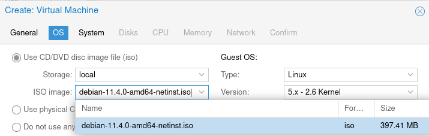
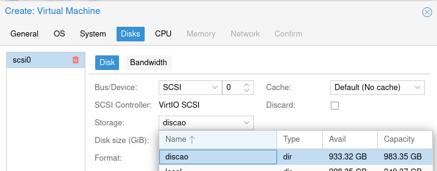
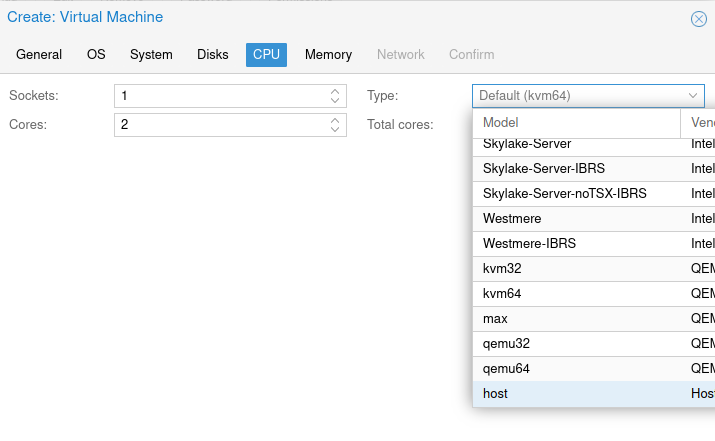
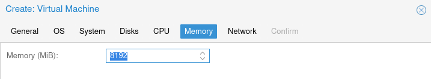

## Instruções para a instalação das VMs
Para criar uma máquina, basta clicar em **Create VM** e seguir os passos abaixo.

**1)** Dar um nome à máquina.

**2)** Escolher como mídia de instalação o **Debian 11**.

**3)** Basta prosseguir em **System**.

**4)** Escolher `discao` como **Storage**.

**5)** Escolher `host` como **tipo**.

**6)** Usar **8192MB** de memória.

**7)** Basta prosseguir em **Network** e finalizar.
